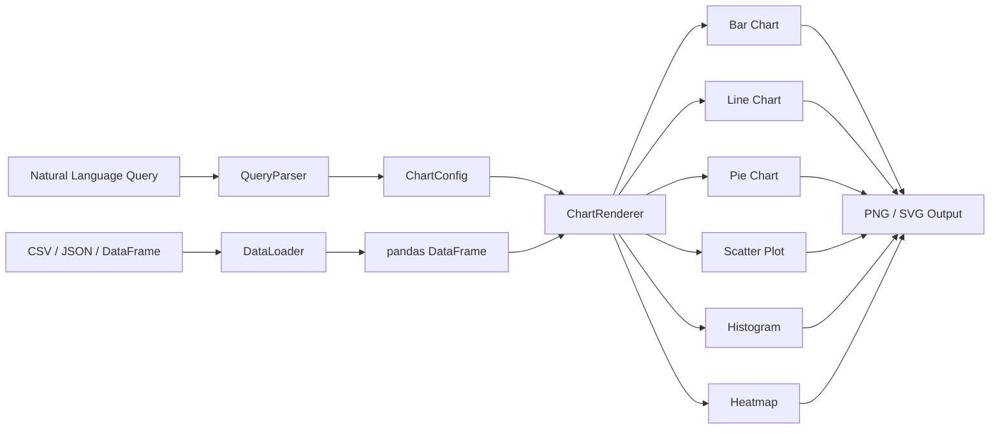

# ChartMind

[](https://github.com/MukundaKatta/ChartMind/actions/workflows/ci.yml)
[](https://www.python.org/downloads/)
[](LICENSE)
[](https://pypi.org/project/chartmind/)

**Natural language to chart generator** -- a Python library that generates beautiful charts from natural language descriptions of your data.

---

## Architecture



## Quickstart

### Installation

```bash
pip install chartmind
```

### Python API

```python
from chartmind import ChartGenerator

gen = ChartGenerator()

# Generate a chart from a natural language query + CSV file
config = gen.generate(
    query="Show total revenue by month as a bar chart",
    data="sales.csv",
    output="chart.png",
)
print(config.chart_type)  # "bar"
print(config.title)       # "Sum Revenue by Month"
```

### With a DataFrame

```python
import pandas as pd
from chartmind import ChartGenerator

df = pd.DataFrame({
    "region": ["North", "South", "East", "West"],
    "sales": [120, 98, 150, 130],
})

gen = ChartGenerator()
config = gen.generate(
    query="pie chart of sales by region",
    data=df,
    output="pie.png",
)
```

### Config-only (no rendering)

```python
config = gen.generate_config(
    "average score by department",
    columns=["score", "department"],
)
# Returns a plain dict: {"chart_type": "bar", "aggregation": "mean", ...}
```

### CLI

```bash
chartmind "show revenue trend over time by month" --data sales.csv --output trend.png
```

## Supported Chart Types

| Type      | Trigger Keywords                        |
|-----------|-----------------------------------------|
| bar       | bar, compare, column chart              |
| line      | line, trend, over time, timeline        |
| scatter   | scatter, correlation, relationship, xy  |
| pie       | pie, proportion, share, breakdown       |
| histogram | histogram, distribution, frequency      |
| heatmap   | heatmap, heat map, matrix, density      |

## Features

- Auto-detect the best chart type from natural language queries
- Keyword-based NLP -- no ML dependencies, fast and deterministic
- Supports aggregation (sum, mean, count, min, max)
- Filter clauses ("where region equals North")
- Six chart types: bar, line, scatter, pie, histogram, heatmap
- CSV and JSON data loading via pandas
- High-quality matplotlib output (PNG, SVG, PDF)
- Pydantic-validated configuration models
- CLI powered by Typer

## Development

```bash
# Clone the repository
git clone https://github.com/MukundaKatta/ChartMind.git
cd ChartMind

# Install in development mode
make install-dev

# Run tests
make test

# Run linter
make lint

# Type checking
make typecheck
```

## Contributing

See [CONTRIBUTING.md](CONTRIBUTING.md) for guidelines.

## License

[MIT License](LICENSE) -- 2026 Officethree Technologies

---

> Inspired by data visualization AI trends

**Built by Officethree Technologies | Made with ❤️ and AI**
